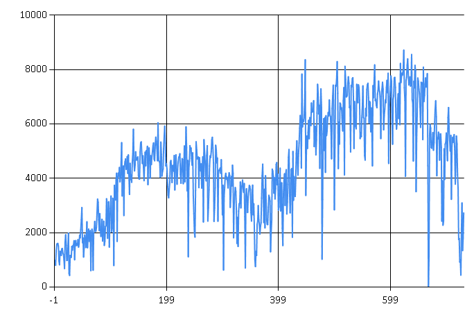
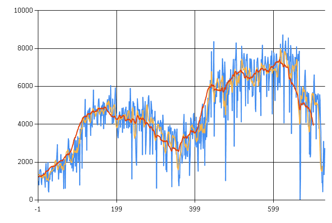

# F# Type Provider Snippets

An F# type provider is a component applied to an external data source (such as the [World Bank] API) that provides types, properties, and methods for use in your program. It enables both IDE IntelliSense and inferred strong typing.

[World Bank]: <http://data.worldbank.org/>

#### Bicycle Rental Example

Plots derived from extracted and transformed csv data.

##### Day-By-Day Bicycle Usage Over Time Since The First Observation

##### Original Series Overlaid With The Moving Averages Over Seven Days And Thirty Days

